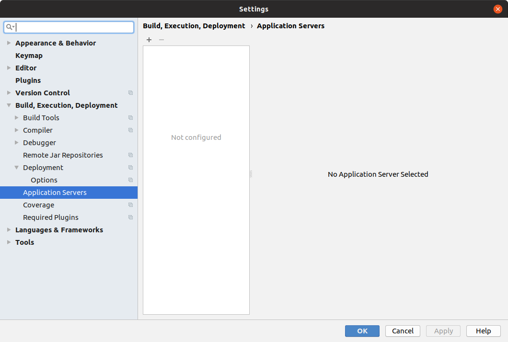
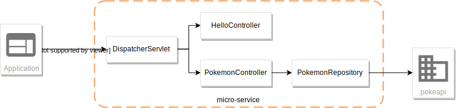

:source-highlighter: pygments
:icons: font

:iconfont-cdn: //use.fontawesome.com/releases/v5.4.2/css/all.css

:toc: left
:toclevels: 4

:sectlinks:
:sectanchors:
:sectnums:

= IFI JEE - TP 2 - Handcraft

== Présentation et objectifs

image::images/architecture.svg[inline]

Le but est de créer une architecture "à la microservice".

Dans cette architecture, chaque composant a son rôle précis :

* la servlet reçoit les requêtes HTTP, et les envoie au bon controller (rôle de point d'entrée de l'application)
* le controlleur implémente une méthode Java par route HTTP, récupère les paramètres, et appelle le service (rôle de routage)
* le service implémente le métier de notre micro-service
* le repository représente les accès aux données (avec potentiellement une base de données)

Et pour s'amuser un peu, nous allons réaliser un micro-service qui nous renvoie des données sur les Pokemons !

image::images/micro-service-poke.png[]

[NOTE]
====
On retrouve en général le même découpage dans les micro-services NodeJS avec express:

* La déclaration de l'application (express)
* La déclaration des routeurs (express.Router)
* L'implémentation du code métier et les accès à une base de données
====

Nous allons donc développer un micro-service, qui exposera un canal de communication REST/JSON.

Pour ce faire, nous allons:

* Créer des annotations Java pour représenter nos objects
* Créer une servlet, qui se configurera dynamiquement pour router les requêtes au bon controlleur
* Implémenter un petit service

== La première Servlet et la structure projet

Pour commencer, créons une première servlet.

=== Initialisation du projet

==== Création de l'arborescence projet

Créer un répertoire projet:

[source,bash]
----
$ mkdir handcraft
----

Créer les répertoires de sources java et de test

[source,bash]
----
$ cd monProjet
$ mkdir -p src/main/java
----

Initialiser un fichier pom.xml à la racine du projet

[source,xml]
----
<project>
    <modelVersion>4.0.0</modelVersion>
    <groupId>com.ifi.tp</groupId>
    <artifactId>handcraft</artifactId>
    <version>0.1.0</version>
    <packaging>war</packaging> <!--1-->

    <properties>
        <maven.compiler.source>11</maven.compiler.source> <!--2-->
        <maven.compiler.target>11</maven.compiler.target> <!--3-->
    </properties>

    <dependencies>
    </dependencies>

</project>
----
<1> On va fabriquer un war
<2> On indique à maven quelle version de Java utiliser pour les sources !
<3> On indique à maven quelle version de JVM on cible !

=== Ecriture de la première servlet

Pour écrire notre première servlet, nous avons besoin de la dépendance `javax.servlet-api`.
Cette dépendance aura le scope `provided` puisque:

* nous en avons besoin à la compilation
* à l'exécution, c'est `Tomcat` qui portera la librairie

Ajouter la dépendance suivante dans votre `pom.xml`

[source,xml]
----
<dependency>
    <groupId>javax.servlet</groupId>
    <artifactId>javax.servlet-api</artifactId>
    <version>3.1.0</version>
    <scope>provided</scope> <!--1-->
</dependency>
----
<1> On précise bien un scope _provided_ à Maven

Ecrire une première servlet :

.src/main/java/FirstServlet.java
[source,java]
----
public class FirstServlet extends HttpServlet {

    @Override
    protected void doGet(HttpServletRequest req, HttpServletResponse resp) throws ServletException, IOException {
        var writer = resp.getWriter();
        writer.println("Hello !"); // <1>
    }

    @Override
    public void init(ServletConfig config) throws ServletException {
        super.init(config);

        System.out.println("Initialisation de la servlet"); // <2>
    }
}
----
<1> On dit bonjour !
<2> On affiche un log au démarrage

Ecrire un fichier web.xml pour déclarer la servlet:

.src/main/webapp/WEB-INF/web.xml
[source,xml]
----
<?xml version="1.0" encoding="UTF-8"?>

<web-app xmlns="http://xmlns.jcp.org/xml/ns/javaee"
         xmlns:xsi="http://www.w3.org/2001/XMLSchema-instance"
         xsi:schemaLocation="http://xmlns.jcp.org/xml/ns/javaee http://xmlns.jcp.org/xml/ns/javaee/web-app_3_1.xsd"
         version="3.1">

    <display-name>handcraft</display-name> <!--1-->

    <servlet>
        <servlet-name>dispatcherServlet</servlet-name> <!--2-->
        <servlet-class>io.codeka.handcraft.servlet.DispatcherServlet</servlet-class>
        <load-on-startup>1</load-on-startup> <!--4-->
    </servlet>

    <servlet-mapping>
        <servlet-name>dispatcherServlet</servlet-name>
        <url-pattern>/*</url-pattern> <!--3-->
    </servlet-mapping>

</web-app>
----
<1> Notre application
<2> Notre servlet
<3> On écoute l'ensemble des URLs !
<4> _load-on-startup_ permet de préciser qu'on souhaite démarrer la servlet immédiatement
(sans attendre la première requête)

=== Installation de Tomcat

Nous avons besoin de Tomcat pour exécuter notre Servlet !

Télécharger tomcat depuis la page officielle : https://tomcat.apache.org/download-90.cgi

Récupérer le zip ou le tar.gz.

==== Configuration pour IntelliJ IDEA

Ajouter le serveur Tomcat à IntelliJ

image::images/02-tomcat-intellij-added.png[]

Créer une configuration d'exécution utilisant le Tomcat

image::images/03-tomcat-run-config-server.png[]

image::images/04-tomcat-run-config-artifacts.png[]

=== Démarrer notre première Servlet

Démarrez votre serveur Tomcat, avec votre servlet, et allez constater le résultat !

[NOTE]
Votre application est disponible à l'URL http://localhost:8080

== Passer votre servlet en mode "annotations" `servlet-api` 3.0

=== Le code

Depuis la version 3.0 de `servlet-api`, les servlets supportent les annotations Java.

Plus besoin de `web.xml`!

Supprimer le fichier `web.xml`, et le répertoire `src/main/webapp`.

Modifier la servlet pour ajouter une annotation java :

.src/main/java/FirstServlet.java
[source,java]
----
@WebServlet(urlPatterns = "/*", //<1> <2>
  loadOnStartup = 1) // <3>
public class FirstServlet extends HttpServlet {

    @Override
    protected void doGet(HttpServletRequest req, HttpServletResponse resp) throws ServletException, IOException {
        PrintWriter writer = resp.getWriter();
        writer.println("Hello !");
    }

    @Override
    public void init(ServletConfig config) throws ServletException {
        super.init(config);

        System.out.println("Initialisation de la servlet"); // <2>
    }
}
----
<1> On déclare la servlet avec une annotation java !
<2> On déclare les URL d'écoute
<3> et on déclare souhaiter démarrer la servlet sans attendre de première requête

=== Le packaging

Par défaut, Maven ne connaît pas les servlets 3.0. Il s'attend donc à trouver un fichier `web.xml` dans le répertoire
`src/main/webapp/WEB-INF`.

Si on lance un `mvn package` après avoir supprimé le `web.xml` et le répertoire `webapp`, on obtient l'erreur suivante :

.mvn package
[source,bash]
----
$> mvn clean package
[INFO] Scanning for projects...
[INFO]
[INFO] ------------------------< io.codeka:handcraft >-------------------------
[INFO] Building handcraft 1.0.0
[INFO] --------------------------------[ war ]---------------------------------
[INFO]
[INFO] --- maven-clean-plugin:2.5:clean (default-clean) @ handcraft ---
[INFO] Deleting /home/jwittouck/workspaces/ifi/tp-ifi-2018-handcrafting/target
[INFO]
[INFO] --- maven-resources-plugin:2.6:resources (default-resources) @ handcraft ---
[WARNING] Using platform encoding (UTF-8 actually) to copy filtered resources, i.e. build is platform dependent!
[INFO] skip non existing resourceDirectory /home/jwittouck/workspaces/ifi/tp-ifi-2018-handcrafting/src/main/resources
[INFO]
[INFO] --- maven-compiler-plugin:3.1:compile (default-compile) @ handcraft ---
[INFO] Changes detected - recompiling the module!
[WARNING] File encoding has not been set, using platform encoding UTF-8, i.e. build is platform dependent!
[INFO] Compiling 1 source file to /home/jwittouck/workspaces/ifi/tp-ifi-2018-handcrafting/target/classes
[INFO]
[INFO] --- maven-resources-plugin:2.6:testResources (default-testResources) @ handcraft ---
[WARNING] Using platform encoding (UTF-8 actually) to copy filtered resources, i.e. build is platform dependent!
[INFO] skip non existing resourceDirectory /home/jwittouck/workspaces/ifi/tp-ifi-2018-handcrafting/src/test/resources
[INFO]
[INFO] --- maven-compiler-plugin:3.1:testCompile (default-testCompile) @ handcraft ---
[INFO] No sources to compile
[INFO]
[INFO] --- maven-surefire-plugin:2.12.4:test (default-test) @ handcraft ---
[INFO] No tests to run.
[INFO]
[INFO] --- maven-war-plugin:2.2:war (default-war) @ handcraft ---
WARNING: An illegal reflective access operation has occurred
WARNING: Illegal reflective access by com.thoughtworks.xstream.core.util.Fields (file:/home/jwittouck/.m2/repository/com/thoughtworks/xstream/xstream/1.3.1/xstream-1.3.1.jar) to field java.util.Properties.defaults
WARNING: Please consider reporting this to the maintainers of com.thoughtworks.xstream.core.util.Fields
WARNING: Use --illegal-access=warn to enable warnings of further illegal reflective access operations
WARNING: All illegal access operations will be denied in a future release
[INFO] Packaging webapp
[INFO] Assembling webapp [handcraft] in [/home/jwittouck/workspaces/ifi/tp-ifi-2018-handcrafting/target/handcraft-1.0.0]
[INFO] Processing war project
[INFO] Copying webapp resources [/home/jwittouck/workspaces/ifi/tp-ifi-2018-handcrafting/src/main/webapp]
[INFO] Webapp assembled in [25 msecs]
[INFO] Building war: /home/jwittouck/workspaces/ifi/tp-ifi-2018-handcrafting/target/handcraft-1.0.0.war
[INFO] ------------------------------------------------------------------------
[INFO] BUILD FAILURE
[INFO] ------------------------------------------------------------------------
[INFO] Total time: 1.757 s
[INFO] Finished at: 2018-10-26T16:51:00+02:00
[INFO] ------------------------------------------------------------------------
[ERROR] Failed to execute goal org.apache.maven.plugins:maven-war-plugin:2.2:war (default-war) on project handcraft: Error assembling WAR: webxml attribute is required (or pre-existing WEB-INF/web.xml if executing in update mode) -> [Help 1] <1>
[ERROR]
[ERROR] To see the full stack trace of the errors, re-run Maven with the -e switch.
[ERROR] Re-run Maven using the -X switch to enable full debug logging.
[ERROR]
[ERROR] For more information about the errors and possible solutions, please read the following articles:
[ERROR] [Help 1] http://cwiki.apache.org/confluence/display/MAVEN/MojoExecutionException
----
<1> Maven n'est pas content, et veut un fichier `web.xml` !

Pour corriger ce comportement, il faut utiliser une version récente du plugin maven `war`.
Pour ce faire, ajouter dans votre `pom.xml` le bloc suivant (en dessous de votre bloc `dependencies`)

.pom.xml
[source,xml]
----
<build>
    <pluginManagement>
        <plugins>
            <plugin>
                <artifactId>maven-war-plugin</artifactId>
                <version>3.2.2</version> <!--1-->
            </plugin>
        </plugins>
    </pluginManagement>
</build>
----
<1> La version 3.2.2 du maven-war-plugin ne nécessite pas de fichier web.xml par défaut, comme précisé dans la https://maven.apache.org/plugins/maven-war-plugin/war-mojo.html#failOnMissingWebXml[documentation]

On relance un `mvn package` pour valider la configuration

.mvn package
[source,bash]
----
$> mvn clean package
[INFO] Scanning for projects...
[INFO]
[INFO] ------------------------< io.codeka:handcraft >-------------------------
[INFO] Building handcraft 1.0.0
[INFO] --------------------------------[ war ]---------------------------------
[INFO]
[INFO] --- maven-clean-plugin:2.5:clean (default-clean) @ handcraft ---
[INFO] Deleting /home/jwittouck/workspaces/ifi/tp-ifi-2018-handcrafting/target
[INFO]
[INFO] --- maven-resources-plugin:2.6:resources (default-resources) @ handcraft ---
[WARNING] Using platform encoding (UTF-8 actually) to copy filtered resources, i.e. build is platform dependent!
[INFO] skip non existing resourceDirectory /home/jwittouck/workspaces/ifi/tp-ifi-2018-handcrafting/src/main/resources
[INFO]
[INFO] --- maven-compiler-plugin:3.1:compile (default-compile) @ handcraft ---
[INFO] Changes detected - recompiling the module!
[WARNING] File encoding has not been set, using platform encoding UTF-8, i.e. build is platform dependent!
[INFO] Compiling 1 source file to /home/jwittouck/workspaces/ifi/tp-ifi-2018-handcrafting/target/classes
[INFO]
[INFO] --- maven-resources-plugin:2.6:testResources (default-testResources) @ handcraft ---
[WARNING] Using platform encoding (UTF-8 actually) to copy filtered resources, i.e. build is platform dependent!
[INFO] skip non existing resourceDirectory /home/jwittouck/workspaces/ifi/tp-ifi-2018-handcrafting/src/test/resources
[INFO]
[INFO] --- maven-compiler-plugin:3.1:testCompile (default-testCompile) @ handcraft ---
[INFO] No sources to compile
[INFO]
[INFO] --- maven-surefire-plugin:2.12.4:test (default-test) @ handcraft ---
[INFO] No tests to run.
[INFO]
[INFO] --- maven-war-plugin:3.2.2:war (default-war) @ handcraft ---
[INFO] Packaging webapp
[INFO] Assembling webapp [handcraft] in [/home/jwittouck/workspaces/ifi/tp-ifi-2018-handcrafting/target/handcraft-1.0.0]
[INFO] Processing war project
[INFO] Copying webapp resources [/home/jwittouck/workspaces/ifi/tp-ifi-2018-handcrafting/src/main/webapp]
[INFO] Webapp assembled in [32 msecs]
[INFO] Building war: /home/jwittouck/workspaces/ifi/tp-ifi-2018-handcrafting/target/handcraft-1.0.0.war
[INFO] ------------------------------------------------------------------------
[INFO] BUILD SUCCESS <1>
[INFO] ------------------------------------------------------------------------
[INFO] Total time: 1.832 s
[INFO] Finished at: 2018-10-26T16:59:26+02:00
[INFO] ------------------------------------------------------------------------
----
<1> Maven est content !

[NOTE]
Validez que votre servlet fonctionne toujours en la démarrant et en allant voir http://localhost:8080

== La servlet dynamique

=== Les annotations

Nous allons utiliser des annotations Java customisées pour créer notre couche de routage.
Ces annotations seront analysées par la servlet, avec l'aide des api `java.lang.reflect`, afin de configurer
le routage des requêtes HTTP vers le bon controller.

Pour la couche Controller, nous allons créer 2 annotations :

* `@Controller` : afin de marquer une classe comme étant un controller dans notre architecture
* `@RequestMapping` : afin de marquer une méthode de controller comme devant recevoir des requêtes HTTP

Créer les annotations suivantes dans votre projet :

.L'annotation @Controller
[source,java]
----
@Retention(RetentionPolicy.RUNTIME) //<1>
public @interface Controller {
}
----
<1> On met une rétention au _runtime_, puisque nous allons utiliser l'annotation à l'exécution

.L'annotation RequestMapping
[source,java]
----
@Retention(RetentionPolicy.RUNTIME) //<1>
public @interface RequestMapping {
    // uri à écouter
    String uri(); //<2>
}
----
<1> On a encore une rétention au _runtime_
<2> Notre annotation utilise un paramètre `uri`, permettant de déclarer quelle URI sera écoutée
(comme ce qu'on peut faire avec une servlet)

=== Notre premier controller

.Un controller simple qui dit bonjour
[source,java]
----
@Controller //<1>
public class HelloController {

    @RequestMapping(uri="/hello") //<2>
    public String sayHello(){
        return "Hello World !";
    }

    @RequestMapping(uri="/bye")
    public String sayGoodBye(){
        return "Goodbye !";
    }

    @RequestMapping(uri="/boum")
    public String explode(){
        throw new RuntimeException("Explosion !"); //<3>
    }

}
----
<1> Nous utilisons ici notre annotation
<2> La méthode `sayHello` écoute à l'URI `/hello` et renvoie une chaîne de caractères
<3> La méthode `explode` lève une exception !

=== L'analyse dynamique du code

Notre servlet, que l'on nommera `DispatcherServlet` va analyser le code de notre controller,
pour être capable de router les requêtes HTTP, et récupérer les résultats

Supprimez votre servlet précédente, elle ne nous sera plus utile pour la suite.

Pour réaliser notre servlet, nous allons travailler en TDD (test-driven-development).

J'ai implémenté pour vous les tests, il ne reste plus qu'a les faire passer !

==== JUnit et Maven

Pour utiliser les tests unitaires, il faut rajouter JUnit en dépendance maven.

Ajoutez les dépendances suivant dans votre pom.xml

.pom.xml
[source,xml]
----
<dependency>
    <groupId>org.junit.jupiter</groupId>
    <artifactId>junit-jupiter-api</artifactId> <!--1-->
    <version>5.3.1</version>
    <scope>test</scope>
</dependency>
<dependency>
    <groupId>org.junit.jupiter</groupId>
    <artifactId>junit-jupiter-engine</artifactId> <!--2-->
    <version>5.3.1</version>
    <scope>test</scope>
</dependency>
<dependency>
    <groupId>org.mockito</groupId>
    <artifactId>mockito-core</artifactId>
    <version>2.23.0</version>
    <scope>test</scope>
</dependency>
----
<1> L'API de JUnit 5
<2> Le moteur d'exécution

Il vous faut également surcharger la version du `maven-surefire-plugin`
(qui est le plugin maven qui implémente la phase d'exécution des tests).

.pom.xml
[source,xml]
----
<pluginManagement>
    <plugins>
        <plugin>
            <artifactId>maven-war-plugin</artifactId>
            <version>3.2.2</version>
        </plugin>
        <plugin>
            <artifactId>maven-surefire-plugin</artifactId>
            <version>2.22.1</version> <!--1-->
        </plugin>
    </plugins>
</pluginManagement>
----
<1> On a besoin de la version 2.22.0 minimum pour JUnit 5 comme indiqué
https://junit.org/junit5/docs/current/user-guide/#running-tests-build-maven[dans la documentation junit]

==== Le test unitaire

Implémentez le test unitaire suivant :

.DispatcherServletTest.java
[source,java]
----
class DispatcherServletTest { //<1>

    @Nested //<2>
    class RegisterController{ //<2>

        @Test //<3>
        void registerController_throwsIllegalArgumentException_forNonControllerClasses() {
            var servlet = new DispatcherServlet();

            assertThrows(IllegalArgumentException.class, () -> servlet.registerController(String.class));
            assertThrows(IllegalArgumentException.class, () -> servlet.registerController(SomeEmptyClass.class));
        }

        @Test
        void registerController_doesNotRegisters_nonAnnotatedMethods() {
            var servlet = new DispatcherServlet();

            servlet.registerController(SomeControllerClassWithAMethod.class);

            assertTrue(servlet.getMappings().isEmpty());
        }

        @Test
        void registerController_doesNotRegisters_voidReturningMethods() {
            var servlet = new DispatcherServlet();

            servlet.registerController(SomeControllerClassWithAVoidMethod.class);

            assertTrue(servlet.getMappings().isEmpty());
        }

        @Test
        void registerController_shouldRegisterCorrectyMethods(){
            var servlet = new DispatcherServlet();

            servlet.registerController(SomeControllerClass.class);
            servlet.registerController(SomeOtherControllerClass.class);

            assertEquals("someGoodMethod", servlet.getMappingForUri("/test").getName());
            assertEquals("someOtherNiceMethod", servlet.getMappingForUri("/otherTest").getName());
        }

        @Test //<5>
        void registerHelloController_shouldWorkCorrectly(){
            var servlet = new DispatcherServlet();
            servlet.registerController(HelloController.class);

            assertEquals("sayHello", servlet.getMappingForUri("/hello").getName());
            assertEquals("sayGoodBye", servlet.getMappingForUri("/bye").getName());
            assertEquals("explode", servlet.getMappingForUri("/boum").getName());
        }
    }

}

//<4>
class SomeEmptyClass{}

@Controller
class SomeControllerClassWithAMethod{
    public String myMethod(){
        return "test";
    }
}

@Controller
class SomeControllerClassWithAVoidMethod{
    @RequestMapping(uri="/test")
    public void myMethod(){}
}

@Controller
class SomeControllerClass {
    @RequestMapping(uri="/test")
    public String someGoodMethod(){
        return "Hello";
    }

    @RequestMapping(uri="/test-throwing")
    public String someThrowingMethod(){
        throw new RuntimeException("some exception message");
    }

    @RequestMapping(uri="/test-with-params")
    public String someThrowingMethod(Map<String, String[]> params){
        return params.get("id")[0];
    }
}

@Controller
class SomeOtherControllerClass {
    @RequestMapping(uri="/otherTest")
    public String someOtherNiceMethod(){
        return "Hello again";
    }
}
----
<1> Notre classe de test
<2> On utilise une sous-classe de tests annotée `@Nested` pour regrouper nos tests unitaires (disponible en
https://junit.org/junit5/docs/5.0.3/user-guide/#writing-tests-nested[Junit 5] )
<3> Nos tests sont annotés `@Test`
<4> Quelques controlleurs d'exemple pour valider le fonctionnement de votre implémentation
<5> On teste l'enregistrement du `HelloController`

==== La DispatcherServlet (code à trous)

Implémentez la servlet suivante :

.La DispatcherServlet
[source,java]
----
@WebServlet(urlPatterns = "/*", loadOnStartup = 1)
public class DispatcherServlet extends HttpServlet {

    private Map<String, Method> uriMappings = new HashMap<>(); //<1>

    @Override
    protected void doGet(HttpServletRequest req, HttpServletResponse resp) throws ServletException, IOException {
        System.out.println("Getting request for " + req.getRequestURI());
        // TODO <3>
    }

    @Override
    public void init(ServletConfig config) throws ServletException {
        super.init(config);
        // on enregistre notre controller au démarrage de la servlet
        this.registerController(HelloController.class);
    }

    protected void registerController(Class controllerClass){
        System.out.println("Analysing class " + controllerClass.getName());

        // TODO <2>
    }

    protected void registerMethod(Method method) {
        System.out.println("Registering method " + method.getName());

        // TODO <2>
    }

    protected Map<String, Method> getMappings(){
        return this.mappings;
    }

    protected Method getMappingForUri(String uri){
        return this.mappings.get(uri);
    }
}
----
<1> Cette `Map` va contenir l'association entre une URI et la méthode Java qui l'écoute (annotée `@RequestMapping`)
<2> C'est là qu'il faut coder !
<3> Cette méthode sera implémentée dans la partie <<Le routage des requêtes (code à trous),4.4>>

Il faut maintenant implémenter les méthodes `registerController` et `registerMethod` pour faire passer les tests unitaires.

[NOTE]
====
Cette partie fait un usage intensif de l'api `java.lang.reflect`

Vous aurez surement besoin des méthodes

* getAnnotation
* getDeclaredMethods
* getDeclaredAnnotation
* newInstance
* etc...
====

=== Le routage des requêtes (code à trous)

Une fois les annotations analysées, le routage des requêtes se fait de la manière suivante :

1. Récupération de l'URI entrante (depuis l'objet HttpServletRequest)
2. Récupération de la méthode implémentant l'URI (issue de l'analyse du code)
 * Si aucune méthode n'est trouvée, renvoyer une erreur 404
3. Instanciation du controller
4. Récupération des paramètres (depuis l'objet HttpServletRequest)
5. Appel de la méthode (avec les paramètres ou non)
 * En cas d'exception, renvoyer une erreur 500 avec le message de l'exception
 * En cas de succès, récupérer le résultat de l'appel, et renvoyer le résultat convertit en chaîne de caractères

Nous devons donc ici, implémenter la méthode `doGet` de notre `DispatcherServlet`.

==== Les tests unitaires du routage

Ajoutez la sous classe de tests suivante dans le test unitaire de la `DispatcherServlet` :

.Les tests unitaires du routage
[source,java]
----
@Nested //<1>
class DoGet{

    @Test
    void doGet_shouldReturn404_whenNotMethodIsFound() throws ServletException, IOException {
        var servlet = new DispatcherServlet();

        var req = mock(HttpServletRequest.class);
        var resp = mock(HttpServletResponse.class);
        when(req.getRequestURI()).thenReturn("/test");

        servlet.doGet(req, resp);

        verify(resp).sendError(404, "no mapping found for request uri /test");
    }

    @Test
    void doGet_shouldReturn500WithMessage_whenMethodThrowsException() throws ServletException, IOException {
        var servlet = new DispatcherServlet();

        servlet.registerController(SomeControllerClass.class);

        var req = mock(HttpServletRequest.class);
        var resp = mock(HttpServletResponse.class);
        when(req.getRequestURI()).thenReturn("/test-throwing");

        servlet.doGet(req, resp);

        verify(resp).sendError(500, "exception when calling method someThrowingMethod : some exception message");
    }

    @Test
    void doGet_shouldReturnAResult_whenMethodSucceeds() throws ServletException, IOException {
        var servlet = new DispatcherServlet();

        servlet.registerController(SomeControllerClass.class);

        var req = mock(HttpServletRequest.class);
        var resp = mock(HttpServletResponse.class);
        var printWriter = mock(PrintWriter.class);

        when(resp.getWriter()).thenReturn(printWriter);
        when(req.getRequestURI()).thenReturn("/test");

        servlet.doGet(req, resp);

        verify(printWriter).print("Hello");
    }

    @Test
    void doGet_shouldReturnAResult_whenMethodWithParametersSucceeds() throws ServletException, IOException {
        var servlet = new DispatcherServlet();

        servlet.registerController(SomeControllerClass.class);

        var req = mock(HttpServletRequest.class);
        var resp = mock(HttpServletResponse.class);
        var printWriter = mock(PrintWriter.class);

        when(req.getRequestURI()).thenReturn("/test-with-params");
        when(req.getParameterMap()).thenReturn(Map.of("id", new String[]{"12"}));
        when(resp.getWriter()).thenReturn(printWriter);

        servlet.doGet(req, resp);

        verify(printWriter).print("12");
    }

    @Test
    void doGet_shouldReturnAResult_forHelloController() throws ServletException, IOException {
        var servlet = new DispatcherServlet();
        servlet.registerController(HelloController.class);

        var req = mock(HttpServletRequest.class);
        var resp = mock(HttpServletResponse.class);
        var printWriter = mock(PrintWriter.class);

        when(req.getRequestURI()).thenReturn("/hello");
        when(resp.getWriter()).thenReturn(printWriter);

        servlet.doGet(req, resp);

        verify(printWriter).print("Hello World !");
    }

}
----
<1> Ajoutez cette classe en sous-classe de la classe `DispatcherServletTest`

Ces tests unitaires valident que les méthodes sont correctement appelées et que les erreurs sont renvoyées.

[NOTE]
====
Une fois tous les tests au vert icon:grin-stars[], vous pouvez démarrer votre projet et requêter via votre navigateur web :

* http://localhost:8080/hello
* http://localhost:8080/bye
* http://localhost:8080/boum
====

== Le micro-service Pokemon

Pour la suite de ce TP, nous allons développer un micro-service pokemon, qui s'appuiera sur notre DispatcherServlet

[WARNING]
Nous utilisons l'API HttpClient de Java 11 dans ce TP. Il est donc impératif de travailler avec le JDK 11.

Le micro-service sera composé de 3 niveaux:

1. La DispatcherServlet
2. Le PokemonController, qui va exposer une route dédiée
3. Le PokemonRepository, qui va invoquer une API externe

Pour avoir quelques données à disposition, nous utiliserons l'API https://pokeapi.co

=== La classe Pokemon

Pour commencer, nous allons créer notre objet métier.

Pour implémenter notre objet, nous devons nous inspirer des champs que propose l'API https://pokeapi.co.

Par exemple, voici ce qu'on obtient en appelant l'API (un peu simplifié):

.Electhor !
[source,json]
----
{
    "abilities": [],
    "base_experience": 261,
    "forms": [
        {
            "name": "zapdos",
            "url": "https://pokeapi.co/api/v2/pokemon-form/145/"
        }
    ],
    "height": 16,
    "id": 145,
    "location_area_encounters": "https://pokeapi.co/api/v2/pokemon/145/encounters",
    "moves": [],
    "name": "zapdos",
    "order": 217,
    "species": {
        "name": "zapdos",
        "url": "https://pokeapi.co/api/v2/pokemon-species/145/"
    },
    "sprites": {
        "back_default": "https://raw.githubusercontent.com/PokeAPI/sprites/master/sprites/pokemon/back/145.png",
        "back_female": null,
        "back_shiny": "https://raw.githubusercontent.com/PokeAPI/sprites/master/sprites/pokemon/back/shiny/145.png",
        "back_shiny_female": null,
        "front_default": "https://raw.githubusercontent.com/PokeAPI/sprites/master/sprites/pokemon/145.png",
        "front_female": null,
        "front_shiny": "https://raw.githubusercontent.com/PokeAPI/sprites/master/sprites/pokemon/shiny/145.png",
        "front_shiny_female": null
    },
    "stats": [
        {
            "base_stat": 100,
            "effort": 0,
            "stat": {
                "name": "speed",
                "url": "https://pokeapi.co/api/v2/stat/6/"
            }
        },
        {
            "base_stat": 90,
            "effort": 0,
            "stat": {
                "name": "special-defense",
                "url": "https://pokeapi.co/api/v2/stat/5/"
            }
        },
        {
            "base_stat": 125,
            "effort": 3,
            "stat": {
                "name": "special-attack",
                "url": "https://pokeapi.co/api/v2/stat/4/"
            }
        },
        {
            "base_stat": 85,
            "effort": 0,
            "stat": {
                "name": "defense",
                "url": "https://pokeapi.co/api/v2/stat/3/"
            }
        },
        {
            "base_stat": 90,
            "effort": 0,
            "stat": {
                "name": "attack",
                "url": "https://pokeapi.co/api/v2/stat/2/"
            }
        },
        {
            "base_stat": 90,
            "effort": 0,
            "stat": {
                "name": "hp",
                "url": "https://pokeapi.co/api/v2/stat/1/"
            }
        }
    ],
    "types": [
        {
            "slot": 2,
            "type": {
                "name": "flying",
                "url": "https://pokeapi.co/api/v2/type/3/"
            }
        },
        {
            "slot": 1,
            "type": {
                "name": "electric",
                "url": "https://pokeapi.co/api/v2/type/13/"
            }
        }
    ],
    "weight": 526
}
----

Nous allons donc créer une classe Java qui reprend trait-pour-trait cette structure, mais en ne conservant que les champs
qui nous intéressent.

.Pokemon.java
[source,java]
----
public class Pokemon {
    //<1>
    private int id;

    private String name;

    private Sprites sprites;
    //<2>
    public int getId() {
        return id;
    }

    public String getName() {
        return name;
    }

    public Sprites getSprites() {
        return sprites;
    }
    //<3>
    public class Sprites{
        private String front_default;

        public String getFront_default() {
            return front_default;
        }
    }

}
----
<1> On sélectionne les champs "id", "name", et "sprites"
<2> On a besoin des getters par la suite
<3> Pour les objets imbriqués, on utilise une classe interne (on pourrait utiliser une classe externe aussi !)

=== Le PokemonRepository

Le repository est donc la classe qui va appeler l'API https://pokeapi.co, en fonction de paramètres,
et retourner notre Pokemon.

Le repository va utiliser :

* L'API HttpClient du JDK 11 pour exécuter les requêtes HTTP
* L'API jackson-databind pour convertir le JSON retourné par https://pokeapi.co en objet Java

==== jackson-databind

Ajouter la dépendance suivante à votre projet :

.pom.xml
[source,xml]
----
<dependency>
    <groupId>com.fasterxml.jackson.core</groupId>
    <artifactId>jackson-databind</artifactId>
    <version>2.9.7</version>
</dependency>
----

Ecrire un test unitaire pour apprendre à manipuler _jackson-databind_ :

.JacksonDatabindTest.java
[source,java]
----
class JacksonDatabindTest {

    public static class Car { //<1>
        public String color;
        public String brand;
    }

    @Test
    void testWriteJson() throws JsonProcessingException { //<2>
        var objectMapper = new ObjectMapper();
        var car = new Car();
        car.color = "yellow";
        car.brand = "renault";
        var json = objectMapper.writeValueAsString(car);
        assertEquals("{\"color\":\"yellow\",\"brand\":\"renault\"}", json);
    }

    @Test
    void testReadJson() throws IOException { //<3>
        var objectMapper = new ObjectMapper();
        var json = "{ \"color\" : \"black\", \"brand\" : \"opel\" }";
        var car = objectMapper.readValue(json, Car.class);
        assertEquals("black", car.color);
        assertEquals("opel", car.brand);
    }

}
----
<1> La classe qui représente nos données
<2> L'écriture de JSON depuis notre objet
<3> La lecture d'un JSON pour reconstruire un objet

Plus d'infos sur le https://github.com/FasterXML/jackson-databind[Github] de jackson-databind

[TIP]
Dans la DispatcherServlet, on peut utiliser jackson-databind pour transformer le résultat de nos appels de controllers en JSON !

==== HttpClient

La documentation http://openjdk.java.net/groups/net/httpclient/intro.html[ici] et un bon article https://dzone.com/articles/java-11-standardized-http-client-api[là].

==== Les tests unitaires du repository

Comme pour la `DispatcherServlet`, nous allons travailler en TDD.

Voici la classe de teests unitaires à implémenter

.PokemonRepositoryTest.java
[source,java]
----
class PokemonRepositoryTest {

    @Test //<1>
    void getPokemon_callsHttpClientApi() throws IOException, InterruptedException {
        var repo = new PokemonRepository();

        var httpClient = mock(HttpClient.class);
        var objectMapper = mock(ObjectMapper.class);

        repo.setHttpClient(httpClient);
        repo.setObjectMapper(objectMapper);

        var httpResponse = mock(HttpResponse.class);
        when(httpClient.send(any(), any())).thenReturn(httpResponse);
        when(httpResponse.statusCode()).thenReturn(200);
        when(httpResponse.body()).thenReturn("{\"id\":\"25\",\"name\":\"pikachu\"}");

        repo.getPokemonFromId(25);

        var httpRequestCaptor = ArgumentCaptor.forClass(HttpRequest.class);
        verify(httpClient).send(httpRequestCaptor.capture(), eq(HttpResponse.BodyHandlers.ofString()));

        var httpRequest = httpRequestCaptor.getValue();
        assertEquals("GET", httpRequest.method());
        assertEquals("https://pokeapi.co/api/v2/pokemon/25", httpRequest.uri().toString());

        verify(objectMapper).readValue("{\"id\":\"25\",\"name\":\"pikachu\"}", Pokemon.class);
    }

    @Test
    void getPokemon_callsHttpClientName() throws IOException, InterruptedException {
        var repo = new PokemonRepository();

        var httpClient = mock(HttpClient.class);
        var objectMapper = mock(ObjectMapper.class);

        repo.setHttpClient(httpClient);
        repo.setObjectMapper(objectMapper);

        var httpResponse = mock(HttpResponse.class);
        when(httpClient.send(any(), any())).thenReturn(httpResponse);
        when(httpResponse.statusCode()).thenReturn(200);
        when(httpResponse.body()).thenReturn("{\"id\":\"145\",\"name\":\"zapdos\"}");

        repo.getPokemonFromName("zapdos");

        var httpRequestCaptor = ArgumentCaptor.forClass(HttpRequest.class);
        verify(httpClient).send(httpRequestCaptor.capture(), eq(HttpResponse.BodyHandlers.ofString()));

        var httpRequest = httpRequestCaptor.getValue();
        assertEquals("GET", httpRequest.method());
        assertEquals("https://pokeapi.co/api/v2/pokemon/zapdos", httpRequest.uri().toString());

        verify(objectMapper).readValue("{\"id\":\"145\",\"name\":\"zapdos\"}", Pokemon.class);
    }

    @Test
    void getPokemonFromId() { //<2>
        var repo = new PokemonRepository();
        var pokemon = repo.getPokemonFromId(25);

        assertEquals(25, pokemon.getId());
        assertEquals("pikachu", pokemon.getName());
        assertEquals("https://raw.githubusercontent.com/PokeAPI/sprites/master/sprites/pokemon/25.png", pokemon.getSprites().getFront_default());
    }

    @Test
    void getPokemonFromName() { //<3>
        var repo = new PokemonRepository();
        var pokemon = repo.getPokemonFromName("zapdos");

        assertEquals(145, pokemon.getId());
        assertEquals("zapdos", pokemon.getName());
        assertEquals("https://raw.githubusercontent.com/PokeAPI/sprites/master/sprites/pokemon/145.png", pokemon.getSprites().getFront_default());
    }
}
----
<1> Ce test valide que l'API HttpClient est correctement manipulée
<2> On valide la récupération d'un pokemon par son id
<3> et par son nom

==== Le PokemonRepository

Et voici la classe du repository, à compléter !

.PokemonRepository.java
[source,java]
----
public class PokemonRepository {

    private HttpClient httpClient; //<1>

    private ObjectMapper objectMapper; //<2>

    public PokemonRepository(){
        httpClient = HttpClient.newBuilder() //<1>
            .followRedirects(HttpClient.Redirect.ALWAYS) //<1>
            .build();

        objectMapper = new ObjectMapper();
        objectMapper.configure(DeserializationFeature.FAIL_ON_UNKNOWN_PROPERTIES, false); // <2>
    }

    public Pokemon getPokemonFromId(int id){
        System.out.println("Loading Pokemon information for Pokemon id " + id);

        // TODO
    }

    public Pokemon getPokemonFromName(String name){
        System.out.println("Loading Pokemon information for Pokemon name " + name);

        // TODO
    }

    public void setHttpClient(HttpClient httpClient) {
        this.httpClient = httpClient;
    }

    public void setObjectMapper(ObjectMapper objectMapper) {
        this.objectMapper = objectMapper;
    }
}
----

==== Le PokemonController

Ecrire un controller qui expose une route "/pokemon".
Cette route pourra être appelée avec des paramètres éventuels, `id` ou `name`.

Les requêtes devant être implémentées sont donc, par exemple :

* http://localhost:8080/pokemon?id=25
* http://localhost:8080/pokemon?id=145
* http://localhost:8080/pokemon?name=pikachu
* http://localhost:8080/pokemon?name=zapdos

===== Les tests unitaires du PokemonController

Implémenter les tests unitaires suivants :

.PokemonController.java
[source,java]
----
class PokemonControllerTest {

    @InjectMocks
    PokemonController controller;

    @Mock
    PokemonRepository pokemonRepository;

    @BeforeEach
    void init(){
        MockitoAnnotations.initMocks(this);
    }

    @Test
    void getPokemon_shouldRequireAParameter(){
        var exception = assertThrows(IllegalArgumentException.class, () -> controller.getPokemon(null));
        assertEquals("parameters should not be empty", exception.getMessage());
    }

    @Test
    void getPokemon_shouldRequireAKnownParameter(){
        var parameters = Map.of("test", new String[]{"25"});
        var exception = assertThrows(IllegalArgumentException.class, () -> controller.getPokemon(parameters));
        assertEquals("unknown parameter", exception.getMessage());
    }

    @Test
    void getPokemon_withAnIdParameter_shouldReturnAPokemon(){
        var pikachu = new Pokemon();
        pikachu.setId(25);
        pikachu.setName("pikachu");
        when(pokemonRepository.getPokemonFromId(25)).thenReturn(pikachu);

        var parameters = Map.of("id", new String[]{"25"});
        var pokemon = controller.getPokemon(parameters);
        assertNotNull(pokemon);
        assertEquals(25, pokemon.getId());
        assertEquals("pikachu", pokemon.getName());

        verify(pokemonRepository).getPokemonFromId(25);
        verifyNoMoreInteractions(pokemonRepository);
    }

    @Test
    void getPokemon_withANameParameter_shouldReturnAPokemon(){
        var zapdos = new Pokemon();
        zapdos.setId(145);
        zapdos.setName("zapdos");
        when(pokemonRepository.getPokemonFromName("zapdos")).thenReturn(zapdos);

        var parameters = Map.of("name", new String[]{"zapdos"});
        var pokemon = controller.getPokemon(parameters);
        assertNotNull(pokemon);
        assertEquals(145, pokemon.getId());
        assertEquals("zapdos", pokemon.getName());

        verify(pokemonRepository).getPokemonFromName("zapdos");
        verifyNoMoreInteractions(pokemonRepository);
    }

}
----

===== Le PokemonController (code à trous)

Implémenter le PokemonController et compléter la méthode !

.PokemonController.java
[source,java]
----
public class PokemonController {

    private PokemonRepository repository = new PokemonRepository();

    public Pokemon getPokemon(Map<String,String[]> parameters){
        // TODO
    }

}
----

[TIP]
Peut-être faut-il ajouter des annotations java sur le controller pour l'enregistrer auprès de la `DispatcherServlet`.

===== Modifications de la DispatcherServlet

Enfin, pour finaliser notre développement, nous devons :

1. Enregistrer notre `PokemonController` dans la `DispatcherServlet` (en modifiant la méthode `init` de la `DispatcherServlet`)
2. Utiliser `jackson-databind` pour transformer les résultats de nos controlleurs en JSON
3. Ne pas oublier de transmettre les paramètres reçus en requête au controlleur.