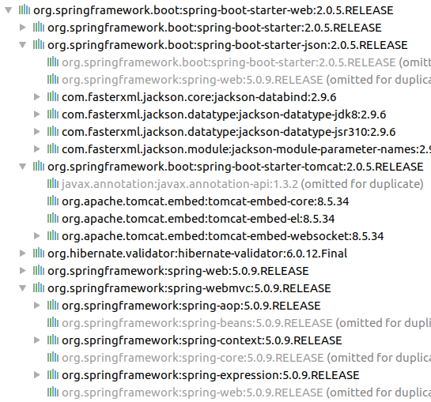

:source-highlighter: pygments
:icons: font

:iconfont-cdn: //use.fontawesome.com/releases/v5.4.2/css/all.css

:toc: left
:toclevels: 4

:sectlinks:
:sectanchors:
:sectnums:

= IFI JEE - TP 3 - Spring

== Présentation et objectifs

image::images/architecture.svg[inline]

Le but est de continuer le développement de notre architecture "à la microservice".

Pour rappel, dans cette architecture, chaque composant a son rôle précis :

* la servlet reçoit les requêtes HTTP, et les envoie au bon controller (rôle de point d'entrée de l'application)
* le controlleur implémente une méthode Java par route HTTP, récupère les paramètres, et appelle le service (rôle de routage)
* le service implémente le métier de notre micro-service
* le repository représente les accès aux données (avec potentiellement une base de données)

Et pour s'amuser un peu, nous allons réaliser un micro-service qui nous renvoie des données sur les Pokemons !

image::images/micro-service-poke.png[]

[NOTE]
====
On retrouve en général le même découpage dans les micro-services NodeJS avec express:

* La déclaration de l'application (express)
* La déclaration des routeurs (express.Router)
* L'implémentation du code métier et les accès à une base de données
====

Nous allons développer :

1. un repository d'accès aux données de Pokemons (à partir d'un fichier CSV)
2. un service d'accès aux données
3. annoter ces composants avec les annotations de Spring et les tester
4. créer un controlleur spring pour gérer nos requêtes HTTP / REST
5. utiliser spring-boot pour instancier notre application !

[TIP]
====
Nous repartons de zéro pour ce TP !
====

== Le projet

Créons un nouveau répertoire projet :

=== Création de l'arborescence projet

Créer un répertoire projet:

[source,bash]
----
$ mkdir tp-03-spring
----

Créer les répertoires de sources java et de test, et de ressources

[source,bash]
----
$ cd monProjet
$ mkdir -p src/main/java
$ mkdir -p src/main/resources
$ mkdir -p src/test/java
$ mkdir -p src/test/resources
----

L'arborescence résultante doit être la suivante :

.L'arborescence de mon projet
image::images/arbo.png[]

Initialiser un fichier pom.xml à la racine du projet

[source,xml]
----
<project>
    <modelVersion>4.0.0</modelVersion>
    <groupId>com.ifi.tp</groupId>
    <artifactId>03-spring</artifactId>
    <version>0.1.0</version>
    <packaging>jar</packaging> <!--1-->

    <properties>
        <maven.compiler.source>11</maven.compiler.source> <!--2-->
        <maven.compiler.target>11</maven.compiler.target> <!--3-->
    </properties>

    <dependencies>

        <!-- testing --> <!--4-->
        <dependency>
            <groupId>org.junit.jupiter</groupId>
            <artifactId>junit-jupiter-api</artifactId>
            <version>5.3.1</version>
            <scope>test</scope>
        </dependency>
        <dependency>
            <groupId>org.junit.jupiter</groupId>
            <artifactId>junit-jupiter-engine</artifactId>
            <version>5.3.1</version>
            <scope>test</scope>
        </dependency>
        <dependency>
            <groupId>org.mockito</groupId>
            <artifactId>mockito-core</artifactId>
            <version>2.23.0</version>
            <scope>test</scope>
        </dependency>

    </dependencies>

    <build> <!--5-->
        <pluginManagement>
            <plugins>
                <plugin>
                    <artifactId>maven-surefire-plugin</artifactId>
                    <version>2.22.1</version>
                </plugin>
            </plugins>
        </pluginManagement>
    </build>

</project>
----
<1> On va fabriquer un jar cette fois ci!
<2> On indique à maven quelle version de Java utiliser pour les sources !
<3> On indique à maven quelle version de Java on cible !
<4> On positionne tout de suite nos dépendances de test
<5> La partie build n'utilise plus le `maven-war-plugin`

Pour préparer les développements, on va également tout de suite créer quelques
packages Java qui vont matérialiser notre architecture applicative.

Créer les packages suivants:

* `com.ifi.tp.bo` : va contenir les objets métier de notre application
* `com.ifi.tp.config` : va contenir la configuration de notre application
* `com.ifi.tp.controller` : va contenir la configuration de notre application
* `com.ifi.tp.repository` : va contenir les repository de notre application
* `com.ifi.tp.service` : va contenir les services de notre application

.Les packages Java de notre application
image::images/packages.png[]

Notre projet est prêt !

[TIP]
====
On peut bien sur utiliser les noms de package que l'on souhaite.
Cette structure est une structure que l'on retrouve très souvent sur les projets
d'entreprise
====

== Le repository

Lors du TP précédent, nous avions écrit un repository qui appelait l'API https://pokeapi.co.

Cette semaine, nous utiliserons directement notre propre source de données.

=== Le fichier de données pokemon.csv

Vous trouverez link:pokemon.csv[ici] un fichier contenant les id et noms des 151 premiers Pokemons!

Téléchargez ce fichier, et déposez le dans le répertoire `src/main/resources`.
Ce fichier servira de _bases de données_.

=== L'ajout de la dépendance CSV

Ajoutez la dépendance suivante dans votre `pom.xml`

.pom.xml
[source,xml]
----
<!-- commons-csv for CSV manipulation -->
<dependency>
    <groupId>org.apache.commons</groupId>
    <artifactId>commons-csv</artifactId>
    <version>1.6</version>
</dependency>
----

=== Le test unitaire

Implémentez le test unitaire suivant :

.src/test/java/com/ifi/tp/repository/PokemonRepositoryImplTest.java
[source,java]
----
class PokemonRepositoryImplTest {

    @Test
    void findPokemonById_with25_shouldReturnPikachu(){
        var repository = new PokemonRepositoryImpl();
        var pikachu = repository.findPokemonById(25);
        assertNotNull(pikachu);
        assertEquals("pikachu", pikachu.getName());
        assertEquals(25, pikachu.getId());
    }

    @Test
    void findPokemonById_with145_shouldReturnZapdos(){
        var repository = new PokemonRepositoryImpl();
        var zapdos = repository.findPokemonById(145);
        assertNotNull(zapdos);
        assertEquals("zapdos", zapdos.getName());
        assertEquals(145, zapdos.getId());
    }

    @Test
    void findPokemonByName_withEevee_shouldReturnEevee(){
        var repository = new PokemonRepositoryImpl();
        var eevee = repository.findPokemonByName("eevee");
        assertNotNull(eevee);
        assertEquals("eevee", eevee.getName());
        assertEquals(133, eevee.getId());
    }

    @Test
    void findPokemonByName_withMewTwo_shouldReturnMewTwo(){
        var repository = new PokemonRepositoryImpl();
        var mewtwo = repository.findPokemonByName("mewtwo");
        assertNotNull(mewtwo);
        assertEquals("mewtwo", mewtwo.getName());
        assertEquals(150, mewtwo.getId());
    }

    @Test
    void findAllPokemon_shouldReturn151Pokemons(){
        var repository = new PokemonRepositoryImpl();
        var pokemons = repository.findAllPokemon();
        assertNotNull(pokemons);
        assertEquals(151, pokemons.size());
    }

}
----

=== L'implémentation

Ajouter l'interface du PokemonRepository et son implémentation

.src/main/java/com/ifi/tp/repository/PokemonRepository.java
[source,java]
----
public interface PokemonRepository {
    Pokemon findPokemonById(int id);
    Pokemon findPokemonByName(String name);
    List<Pokemon> findAllPokemon();
}
----

.src/main/java/com/ifi/tp/repository/PokemonRepositoryImpl.java
[source,java]
----
public class PokemonRepositoryImpl implements PokemonRepository {

    List<Pokemon> pokemons;

    PokemonRepositoryImpl(){ //<1>
        try (Reader in = new FileReader(new File(getClass().getResource("/pokemon.csv").getFile()))) {
            var parser = CSVFormat.RFC4180.withFirstRecordAsHeader().parse(in);
            var records = parser.getRecords();
            this.pokemons = records
                    .parallelStream()
                    .map(this::map)
                    .collect(Collectors.toList());
        } catch (IOException e) {
            e.printStackTrace();
        }
    }

    @Override
    public Pokemon findPokemonById(int id) {
        // TODO <2>
    }

    @Override
    public Pokemon findPokemonByName(String name) {
        // TODO <2>
    }

    @Override
    public List<Pokemon> findAllPokemon() {
        // TODO <2>
    }

    private Pokemon map(CSVRecord record){
        var poke = new Pokemon();
        poke.setId(Integer.parseInt(record.get("id")));
        poke.setName(record.get("identifier"));
        return poke;
    }
}
----
<1> Voici comment lire le fichier CSV.
<2> Implémenter la recherche d'un Pokemon par id et par nom, ainsi que le listing complet !

== Ajout de Spring

Maintenant que nous avons un repository, nous allons utiliser Spring pour
l'instancier !

=== La dépendance à Spring

Modifiez votre `pom.xml` pour ajouter la dépendance à Spring :

.pom.xml
[source,xml]
----
<!-- spring -->
<dependency>
    <groupId>org.springframework</groupId>
    <artifactId>spring-context</artifactId>
    <version>5.1.2.RELEASE</version>
</dependency>
----

=== Le test unitaire

Modifiez le test unitaire de votre repository pour ajouter des éléments liés à Spring

.PokemonRepositoryImplTest.java
[source,java]
----
@Test
void applicationContext_shouldLoadPokemonRepository(){
    var context = new AnnotationConfigApplicationContext("com.ifi.tp.repository"); //<1>
    var repoByName = context.getBean("pokemonRepositoryImpl"); //<2>
    var repoByClass = context.getBean(PokemonRepository.class); //<3>

    assertEquals(repoByName, repoByClass);
    assertNotNull(repoByName);
    assertNotNull(repoByClass);
}
----
<1> Ici, on instancie un `ApplicationContext` Spring, qui est capable d'analyser les annotations Java
on lui donne le nom du package Java que l'on souhaite analyser !
<2> Une fois le context instancié, on lui demande de récupérer le repository
en utilisant le nom de la classe (en CamelCase)
<3> ou en utilisant directement une classe assignable pour notre objet (ici l'interface !)

Pour que Spring arrive à trouver notre classe de repository, il faut poser une annotation dessus !

.PokemonRepositoryImpl.java
[source,java]
----
@Repository
public class PokemonRepositoryImpl implements PokemonRepository {
    [...]
}
----

[IMPORTANT]
Cette phase doit bien être terminée avant de passer à la suite !

== Le service

Maintenant que nous avons un repository fonctionnel, il est temps de développer
un service qui consomme notre repository !

=== Le test unitaire

.src/test/java/com/ifi/tp/service/PokemonServiceImplTest.java
[source,java]
----
class PokemonServiceImplTest {

    @Mock
    PokemonRepository pokemonRepository;

    @Test
    void pokemonRepository_shouldBeCalled_whenFindById(){
        var pokemonRepository = mock(PokemonRepository.class); //<1>
        var pokemonService = new PokemonServiceImpl(pokemonRepository); //<2>

        pokemonService.getPokemon(25);

        verify(pokemonRepository).findPokemonById(25);
    }

    @Test
    void pokemonRepository_shouldBeCalled_whenFindAll(){
        var pokemonRepository = mock(PokemonRepository.class);
        var pokemonService = new PokemonServiceImpl(pokemonRepository);

        pokemonService.getAllPokemons();

        verify(pokemonRepository).findAllPokemon();
    }
}
----
<1> On crée un mock du PokemonRepository
<2> et on l'__injecte__ via le constructeur !

=== L'implémentation

L'interface Java

.src/main/java/com/ifi/tp/service/PokemonService.java
[source,java]
----
public interface PokemonService {
    Pokemon getPokemon(int id);
    List<Pokemon> getAllPokemons();
}
----

et son implémentation

.src/main/java/com/ifi/tp/service/PokemonServiceImpl.java
[source,java]
----
public class PokemonServiceImpl implements PokemonService{

    public PokemonServiceImpl(){ // TODO <1>

    }

    public Pokemon getPokemon(int id) {
        // TODO <1>
    }

    public List<Pokemon> getAllPokemons(){
        // TODO <1>
    }
}
----
<1> à implémenter !

=== Implémentation avec Spring

Ajouter les tests suivants au `PokemonServiceImplTest`.

.PokemonServiceImplTest
[source,java]
----
@Test
void applicationContext_shouldLoadPokemonService(){
    var context = new AnnotationConfigApplicationContext(PokemonServiceImpl.class, PokemonRepositoryImpl.class);
    var serviceByName = context.getBean("pokemonServiceImpl");
    var serviceByClass = context.getBean(PokemonService.class);

    assertEquals(serviceByName, serviceByClass);
    assertNotNull(serviceByName);
    assertNotNull(serviceByClass);
}

@Test
void pokemonRepository_shouldBeAutowired_withSpring(){
    var context = new AnnotationConfigApplicationContext(PokemonServiceImpl.class, PokemonRepositoryImpl.class);
    var service = context.getBean(PokemonServiceImpl.class);
    assertNotNull(service.pokemonRepository);
}
----

[TIP]
====
N'oubliez pas que Spring utilise beaucoup les annotations Java, en voici
quelques unes :

* @Component
* @Service
* @Repository
* @Autowired

N'oubliez pas que certaines de ces annotations peuvent être posées sur des classes,
sur des méthodes, ou sur des constructeurs !
====

[NOTE]
====
Imaginez un peu comment on aurait pu utiliser cette mécanique au sein de la DispatcherServlet
que nous avons écrit la semaine dernière...
====

[IMPORTANT]
Quand vous avez terminé cette étape, prévenez moi !

== Le Controlleur

Implémentons un Controlleur afin d'exposer nos Pokemons en HTTP/REST/JSON.

=== La dépendance à spring-boot

Pour notre Controlleur, et l'exposition en web-service, nous allons utiliser maintenant spring-boot.

Nous devons fortement impacter notre `pom.xml` !

Ajoutez le bloc suivant (au dessus du bloc `<dependencies>` :

.pom.xml
[source,xml]
----
<parent>
    <groupId>org.springframework.boot</groupId>
    <artifactId>spring-boot-starter-parent</artifactId> <!--1-->
    <version>2.0.5.RELEASE</version>
</parent>
----
<1> On importe le pom.xml parent de spring-boot. Cet _héritage_ nous permet de bénéficier
de toutes les déclarations de dépendences qui sont déjà proposées par spring-boot. Ce fichier pom
peut être consulté sur le
https://github.com/spring-projects/spring-boot/blob/master/spring-boot-project/spring-boot-parent/pom.xml[Github de spring-boot]

Supprimez de votre `pom.xml` la dépendance `spring-context` que nous avions ajouté précédemment,
et ajoutez la dépendance suivante :

.pom.xml
[source,xml]
----
<dependency>
    <groupId>org.springframework.boot</groupId>
    <artifactId>spring-boot-starter-web</artifactId> <!--1-->
</dependency>
----
<1> Cette dépendance est visible https://github.com/spring-projects/spring-boot/blob/master/spring-boot-project/spring-boot-starters/spring-boot-starter-web/pom.xml[ici]

Le simple ajout de cette dépendence nous remonte l'ensemble des dépendences suivantes:

On retrouve donc (entre autres):

* jackson-databind (conversions Java/JSON)
* tomcat-embed (Tomcat en version embedded !)
* spring-context (le célèbre)
* spring-web (la partie controlleurs de Spring)

=== Le test unitaire

Le controlleur est simple et s'inpire de ce que nous avons fait au TP précédent.
Cependant, nous n'aurons plus à gérer les paramètres manuellement via une `Map<String,String>`,
mais nous allons utiliser toute la puissance de Spring.

.src/test/java/com/ifi/tp/controller/PokemonControllerTest.java
[source,java]
----
class PokemonControllerTest {

    @Test
    void getPokemon_shouldCallTheService(){
        var service = mock(PokemonService.class);
        var controlleur = new PokemonController(service);

        var pikachu = new Pokemon();
        pikachu.setId(25);
        pikachu.setName("pikachu");
        when(service.getPokemon(25)).thenReturn(pikachu);

        var pokemon = controlleur.getPokemonFromId(25);
        assertEquals("pikachu", pokemon.getName());

        verify(service).getPokemon(25);
    }

    @Test
    void getAllPokemons_shouldCallTheService(){
        var service = mock(PokemonService.class);
        var controlleur = new PokemonController(service);

        controlleur.getAllPokemons();

        verify(service).getAllPokemons();
    }

}
----

=== L'implémentation

Compléter l'implémentation du controller :

.src/main/java/com/ifi/tp/controller/PokemonController.java
[source,java]
----
class PokemonController {

    public PokemonController() { //<1>
    }

    Pokemon getPokemonFromId(int id){
        // TODO <1>
    }

    public List<Pokemon> getAllPokemons() {
        // TODO <1>
    }
}
----
<1> Implémentez !

=== L'instrumentation pour spring-web !

Une fois les tests passés, nous pouvons implementer notre controlleur pour Spring web !

[TIP]
====
Pour vous aider, voici des liens vers la documentation de spring-web :

* https://docs.spring.io/spring/docs/5.1.3.BUILD-SNAPSHOT/spring-framework-reference/web.html#mvc-ann-requestmapping[@RequestMapping]
====

=== L'exécution de notre projet !

Pour exécuter notre projet, nous devons écrire un main java !
Implémentez la classe suivante :

.src/main/java/com/ifi/tp/Application.java
[source,java]
----
@SpringBootApplication //<1>
public class Application {

    public static void main(String... args){
        SpringApplication.run(Application.class, args); //<2>
    }
}
----
<1> On annote la classe comme étant le point d'entrée de notre application
<2> On implémente un main pour démarrer notre application !

Démarrez le main, et observez les logs :

[source,bash]
----
  .   ____          _            __ _ _
 /\\ / ___'_ __ _ _(_)_ __  __ _ \ \ \ \
( ( )\___ | '_ | '_| | '_ \/ _` | \ \ \ \
 \\/  ___)| |_)| | | | | || (_| |  ) ) ) )    //<1>
  '  |____| .__|_| |_|_| |_\__, | / / / /
 =========|_|==============|___/=/_/_/_/
 :: Spring Boot ::        (v2.0.5.RELEASE)

2018-11-13 20:07:10.783  INFO 13235 --- [           main] com.ifi.tp.Application                   : Starting Application on jwittouck-N14xWU with PID 13235 (/home/jwittouck/workspaces/ifi/ifi-2018/tp/03-spring/target/classes started by jwittouck in /home/jwittouck/workspaces/ifi/ifi-2018)
2018-11-13 20:07:10.788  INFO 13235 --- [           main] com.ifi.tp.Application                   : No active profile set, falling back to default profiles: default
2018-11-13 20:07:10.928  INFO 13235 --- [           main] ConfigServletWebServerApplicationContext : Refreshing org.springframework.boot.web.servlet.context.AnnotationConfigServletWebServerApplicationContext@3f4faf53: startup date [Tue Nov 13 20:07:10 CET 2018]; root of context hierarchy
2018-11-13 20:07:13.068  INFO 13235 --- [           main] o.s.b.w.embedded.tomcat.TomcatWebServer  : Tomcat initialized with port(s): 8080 (http)  //<2>
2018-11-13 20:07:13.111  INFO 13235 --- [           main] o.apache.catalina.core.StandardService   : Starting service [Tomcat]
2018-11-13 20:07:13.111  INFO 13235 --- [           main] org.apache.catalina.core.StandardEngine  : Starting Servlet Engine: Apache Tomcat/8.5.34
2018-11-13 20:07:13.131  INFO 13235 --- [ost-startStop-1] o.a.catalina.core.AprLifecycleListener   : The APR based Apache Tomcat Native library which allows optimal performance in production environments was not found on the java.library.path: [/usr/java/packages/lib:/usr/lib64:/lib64:/lib:/usr/lib]
2018-11-13 20:07:13.255  INFO 13235 --- [ost-startStop-1] o.a.c.c.C.[Tomcat].[localhost].[/]       : Initializing Spring embedded WebApplicationContext
2018-11-13 20:07:13.256  INFO 13235 --- [ost-startStop-1] o.s.web.context.ContextLoader            : Root WebApplicationContext: initialization completed in 2356 ms
2018-11-13 20:07:13.322  INFO 13235 --- [ost-startStop-1] o.s.b.w.servlet.ServletRegistrationBean  : Servlet dispatcherServlet mapped to [/]
2018-11-13 20:07:13.327  INFO 13235 --- [ost-startStop-1] o.s.b.w.servlet.FilterRegistrationBean   : Mapping filter: 'characterEncodingFilter' to: [/*]
2018-11-13 20:07:13.327  INFO 13235 --- [ost-startStop-1] o.s.b.w.servlet.FilterRegistrationBean   : Mapping filter: 'hiddenHttpMethodFilter' to: [/*]
2018-11-13 20:07:13.328  INFO 13235 --- [ost-startStop-1] o.s.b.w.servlet.FilterRegistrationBean   : Mapping filter: 'httpPutFormContentFilter' to: [/*]
2018-11-13 20:07:13.328  INFO 13235 --- [ost-startStop-1] o.s.b.w.servlet.FilterRegistrationBean   : Mapping filter: 'requestContextFilter' to: [/*]
2018-11-13 20:07:13.539  INFO 13235 --- [           main] o.s.w.s.handler.SimpleUrlHandlerMapping  : Mapped URL path [/**/favicon.ico] onto handler of type [class org.springframework.web.servlet.resource.ResourceHttpRequestHandler]
2018-11-13 20:07:13.815  INFO 13235 --- [           main] s.w.s.m.m.a.RequestMappingHandlerAdapter : Looking for @ControllerAdvice: org.springframework.boot.web.servlet.context.AnnotationConfigServletWebServerApplicationContext@3f4faf53: startup date [Tue Nov 13 20:07:10 CET 2018]; root of context hierarchy
2018-11-13 20:07:13.918  INFO 13235 --- [           main] s.w.s.m.m.a.RequestMappingHandlerMapping : Mapped "{[/pokemon/{id}],methods=[GET]}" onto com.ifi.tp.bo.Pokemon com.ifi.tp.controller.PokemonController.getPokemonFromId(int) //<3>
2018-11-13 20:07:13.919  INFO 13235 --- [           main] s.w.s.m.m.a.RequestMappingHandlerMapping : Mapped "{[/pokemon],methods=[GET]}" onto java.util.List<com.ifi.tp.bo.Pokemon> com.ifi.tp.controller.PokemonController.getAllPokemons() //<3>
2018-11-13 20:07:13.926  INFO 13235 --- [           main] s.w.s.m.m.a.RequestMappingHandlerMapping : Mapped "{[/error],produces=[text/html]}" onto public org.springframework.web.servlet.ModelAndView org.springframework.boot.autoconfigure.web.servlet.error.BasicErrorController.errorHtml(javax.servlet.http.HttpServletRequest,javax.servlet.http.HttpServletResponse)
2018-11-13 20:07:13.927  INFO 13235 --- [           main] s.w.s.m.m.a.RequestMappingHandlerMapping : Mapped "{[/error]}" onto public org.springframework.http.ResponseEntity<java.util.Map<java.lang.String, java.lang.Object>> org.springframework.boot.autoconfigure.web.servlet.error.BasicErrorController.error(javax.servlet.http.HttpServletRequest)
2018-11-13 20:07:13.958  INFO 13235 --- [           main] o.s.w.s.handler.SimpleUrlHandlerMapping  : Mapped URL path [/webjars/**] onto handler of type [class org.springframework.web.servlet.resource.ResourceHttpRequestHandler]
2018-11-13 20:07:13.958  INFO 13235 --- [           main] o.s.w.s.handler.SimpleUrlHandlerMapping  : Mapped URL path [/**] onto handler of type [class org.springframework.web.servlet.resource.ResourceHttpRequestHandler]
2018-11-13 20:07:14.175  INFO 13235 --- [           main] o.s.j.e.a.AnnotationMBeanExporter        : Registering beans for JMX exposure on startup
2018-11-13 20:07:14.232  INFO 13235 --- [           main] o.s.b.w.embedded.tomcat.TomcatWebServer  : Tomcat started on port(s): 8080 (http) with context path ''
2018-11-13 20:07:14.237  INFO 13235 --- [           main] com.ifi.tp.Application                   : Started Application in 4.042 seconds (JVM running for 4.591)
----
<1> Wao!
<2> On voit que un Tomcat est démarré
<3> On peut voir nos méthodes de controller détectées et instanciées

On peut maintenant tester les URLs suivantes:

* http://localhost:8080/pokemon
* http://localhost:8080/pokemon/25

== Packager notre micro-service

Une fois notre service fonctionnel, nous pouvons le packager.
Notre micro-service sera packagé dans un _jar_ exécutable !

=== Ajouter le plugin spring-boot au pom.xml

Ajoutez le bloc suivant dans votre `pom.xml`

.pom.xml
[source,xml]
----
<build>
    <plugins>
        <plugin>
            <groupId>org.springframework.boot</groupId>
            <artifactId>spring-boot-maven-plugin</artifactId>
        </plugin>
    </plugins>
</build>
----

L'ajout de ce plugin nous met à disposition de nouvelles tâches maven !

Nous pouvons lancer notre application en exécutant la commande suivante :

[source,bash]
----
mvn spring-boot:run
----

=== Packager notre micro-service

Avant de package notre micro-service, nous devons impacter le `PokemonRepositoryImpl`.
La mécanique d'exécution de spring-boot utilise 2 classpaths Java, ce qui impose que les fichiers
de ressources (en particulier notre fichier CSV), doivent être chargés différemment.

Modifiez le constructeur du repository pour être le suivant :

.PokemonRepositoryImpl.java
[source,java]
----
PokemonRepositoryImpl(){
    try (Reader in = new InputStreamReader(new ClassPathResource("pokemon.csv").getInputStream())) {
        var parser = CSVFormat.RFC4180.withFirstRecordAsHeader().parse(in);
        var records = parser.getRecords();
        this.pokemons = records
                .parallelStream()
                .map(this::map)
                .collect(Collectors.toList());
    } catch (IOException e) {
        e.printStackTrace();
    }
}
----

Pour créer un jar de notre service, il faut maintenant lancer la commande :

[source,bash]
----
mvn package
----

Et pour l'exécuter, il suffit alors de lancer :

[source,bash]
----
java -jar target/03-spring.jar
----

[NOTE]
La contruction de _jar_ "autoporté" spring-boot, est aujourd'hui l'état de l'art des approches micro-service !

//== Corrigé
//
//Le corrigé de ce TP est disponible link:tp-03-spring.tar.gz[ici]